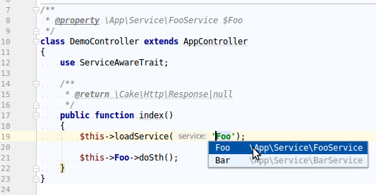
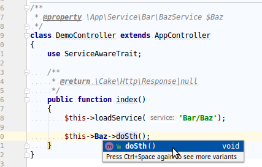

# IDE support

With [IdeHelper](https://github.com/dereuromark/cakephp-ide-helper/) plugin you can get typehinting and autocomplete for your `loadService()` calls.
Especially if you use PHPStorm, this will make it possible to get support here.

## Autocomplete
Include that plugin, set up your generator config and run e.g. `bin/cake phpstorm generate`.

You can include the `ServiceTask` in your `config/app.php` on project level:

```php
use Burzum\CakeServiceLayer\Generator\Task\ServiceTask;

return [
  ...
  'IdeHelper' => [
      'generatorTasks' => [
          ServiceTask::class
      ],
  ],
];
```

It should now add your service classes for autocomplete.



## Typehinting

If you also want to have typehinting and support for your IDE/PHPStan on those protected class properties, you also need the annotator:

```
bin/cake annotations classes
```

For this add this into your config to enable the `ServiceAwareClassAnnotatorTask`:

```php
use Burzum\CakeServiceLayer\Annotator\ClassAnnotatorTask\ServiceAwareClassAnnotatorTask;

return [
  ...
  'IdeHelper' => [
      'classAnnotatorTasks' => [
          ServiceAwareClassAnnotatorTask::class
      ],
  ],
];
```

This will now make the Service typehinted.


